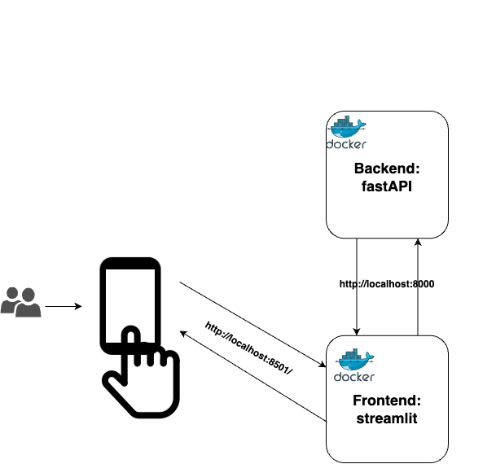

*** 

# Sentiment Analyzer 🦾️

🔬 Smart app that allows you to analyze text. 📄

This document will provide you with a brief overview of the application and its functionalities,
as well as instructions for installation and usage.

***

## Getting Started
***
### Overviwe: 

The apps porpuse is to analyze your text by analyzing its sentiment , key words and summarizeation tool . 

This app is desinged in microservices type of architecture. 

* micro-service 1 --> Backend : fastAPI + Pydantic + ML Models (Docker)

* micro-service 2 --> Frontend : streamlit + requests (Docker)

* micro-servise 3 --> in progress ...




***


### Installation

First, clone the repo : 
```
git clone https://github.com/EASS-HIT-PART-A-2022-CLASS-III/sentiment-analyzer.git
```
Navigate to main folder and run :

```
docker-compose up
```
To run backend , navigate to backend folder and run :

```
docker build -t my_docker .
docker run -p 8000:8000 -it my_docker
```
To run frontend , navigate to frontend folder and run :
```
#docker build -t my_front .
#docker run -p 8501:8501 -it my_front
```
***
## Help
Any advise for common problems or issues.
```
yossidv@hotmail.com
```
